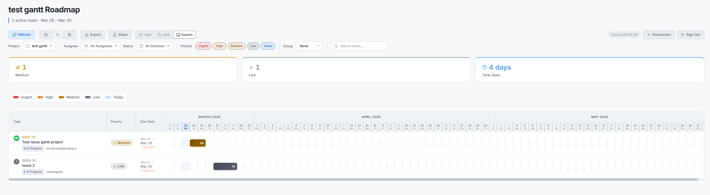

# GanttSmart

**The Gantt chart Linear is missing** — interactive timeline visualization for [Linear](https://linear.app) projects. Drag to reschedule, filter by team, share with clients.

<p>
  <a href="https://github.com/sideq-io/ganttsmart/stargazers"></a>
  <a href="https://github.com/sideq-io/ganttsmart/network/members"></a>
  <a href="https://github.com/sideq-io/ganttsmart/blob/main/LICENSE"></a>
  
  <a href="https://github.com/sideq-io/ganttsmart/commits/main"></a>
</p>

<p>
  <a href="https://ganttsmart.com"></a>
</p>

<p>
  <a href="https://ganttsmart.com">ganttsmart.com</a>
</p>




---

## What It Does

- **Interactive Gantt timeline** with start dates, due dates, and drag-to-reschedule (writes back to Linear via API)
- **Multi-project switching** across your entire Linear workspace
- **Smart filtering** by assignee, status, priority — with instant search across all tasks
- **Collapsible grouping** by assignee, priority, or status for workload visibility
- **Dependency arrows** between blocking/blocked issues (uses Linear's native relations)
- **Milestone markers** rendered as diamonds on the timeline
- **Progress bars** showing sub-issue completion percentage on each Gantt bar
- **Drag entire bars** to shift both start and due dates simultaneously
- **Inline status cycling** — click the status dot to advance through workflow states
- **Slide-out detail panel** — click any bar for full issue details, description, and a direct link to Linear
- **Shareable roadmap links** — public or password-protected URLs for external stakeholders
- **Real-time sync** — auto-polls Linear every 30 seconds
- **Undo** — `Ctrl+Z` to revert any drag or status change
- **Export** — PNG, PDF, or browser print
- **Dark / Light / System** theme toggle
- **Resizable columns** and **zoom controls** (`+` / `-`)
- **Keyboard shortcuts** for power users

---

## Quick Start

```bash
git clone https://github.com/sideq-io/ganttsmart.git
cd ganttsmart
npm install
npm run dev
```

Open [localhost:5173](http://localhost:5173). You'll need Supabase and Linear OAuth credentials — see [Environment Variables](#environment-variables) below.

---

## Tech Stack

| Category | Technologies |
|---|---|
| **Frontend** | React 19, TypeScript, Vite 8, Tailwind CSS 4 |
| **Auth** | Supabase Auth (email/password + Google OAuth) |
| **Linear** | OAuth 2.0 + GraphQL API |
| **Backend** | Supabase Edge Functions (Deno), PostgreSQL with RLS |
| **Export** | html-to-image, jsPDF |
| **Hosting** | Netlify (auto-deploy from `main`) |

---

## Architecture

```
ganttsmart/
├── src/
│   ├── api/              # Linear GraphQL queries + mutations
│   ├── components/       # React components
│   │   ├── GanttChart    # Main chart with calendar, rows, dependency arrows
│   │   ├── GanttRow      # Individual task row with drag handles
│   │   ├── DetailPanel   # Slide-out issue detail panel
│   │   ├── FilterBar     # Project/assignee/status/priority filters
│   │   ├── ShareDialog   # Shareable link management
│   │   └── ...           # AuthPage, Toolbar, Toast, etc.
│   ├── hooks/            # useAuth, useLinearData, useTheme
│   ├── lib/              # Supabase client
│   ├── pages/            # Landing, Callback, SharedView, NotFound
│   ├── utils/            # Export helpers, avatar generation
│   └── types.ts          # Shared TypeScript types
├── supabase/
│   └── functions/        # Edge Functions (tracked in repo)
│       ├── linear-oauth-callback/   # OAuth token exchange
│       └── share-roadmap/           # Share link CRUD + data caching
├── netlify.toml          # Build + SPA redirect config
└── .env.example          # Environment template
```

---

## Environment Variables

| Variable | Description |
|---|---|
| `VITE_SUPABASE_URL` | Supabase project URL |
| `VITE_SUPABASE_ANON_KEY` | Supabase public/anon key |
| `VITE_LINEAR_CLIENT_ID` | Linear OAuth app client ID |
| `VITE_LINEAR_REDIRECT_URI` | OAuth callback (`http://localhost:5173/callback` for dev) |

### Edge Function Secrets (set in Supabase dashboard)

| Secret | Description |
|---|---|
| `LINEAR_CLIENT_ID` | Same as above |
| `LINEAR_CLIENT_SECRET` | Linear OAuth app secret (never in frontend) |
| `LINEAR_REDIRECT_URI` | Production callback URL |

### Setup Steps

1. Copy `.env.example` to `.env` and fill in values
2. Create a Supabase project with `user_settings` and `shared_roadmaps` tables
3. Deploy Edge Functions from `supabase/functions/`
4. Register a [Linear OAuth app](https://linear.app/settings/api/applications) with your redirect URI
5. (Optional) Configure Google OAuth in Supabase dashboard

---

## Keyboard Shortcuts

| Key | Action |
|---|---|
| `R` | Refresh data |
| `+` / `=` | Zoom in |
| `-` / `_` | Zoom out |
| `Ctrl+Z` / `Cmd+Z` | Undo last action |
| `Escape` | Clear search / close panels |

---

## Contributing

Contributions welcome. Please open an issue first to discuss what you'd like to change.

1. Fork the repo
2. Create your branch (`git checkout -b feat/your-feature`)
3. Commit your changes
4. Open a Pull Request

---

## License

**AGPL-3.0** for non-commercial use. **Commercial license** required for any commercial use.

| Use Case | Allowed? |
|---|---|
| Personal / research / educational | Yes |
| Self-hosted (non-commercial) | Yes, with attribution |
| Fork and modify (non-commercial) | Yes, share source under AGPL-3.0 |
| Commercial use / SaaS / rebranding | Requires commercial license |

See [LICENSE](LICENSE) for full terms. For commercial licensing, contact the maintainer.

Copyright (C) 2025-2026 Michel Bitar. All rights reserved.

---

## Authors

**Michel Bitar** — [GitHub](https://github.com/MichelBitar99)
**Anthony Badran** — [GitHub](https://github.com/anthonybadran)


## Contributors

<a href="https://github.com/sideq-io/ganttsmart/graphs/contributors">
  
</a>

---

## Star History

<a href="https://star-history.com/#sideq-io/ganttsmart&Date">
 <picture>
   <source media="(prefers-color-scheme: dark)" srcset="https://api.star-history.com/svg?repos=sideq-io/ganttsmart&type=Date&theme=dark" />
   <source media="(prefers-color-scheme: light)" srcset="https://api.star-history.com/svg?repos=sideq-io/ganttsmart&type=Date" />
   
 </picture>
</a>

---

<p align="center">
  <a href="https://ganttsmart.com">ganttsmart.com</a>
</p>
